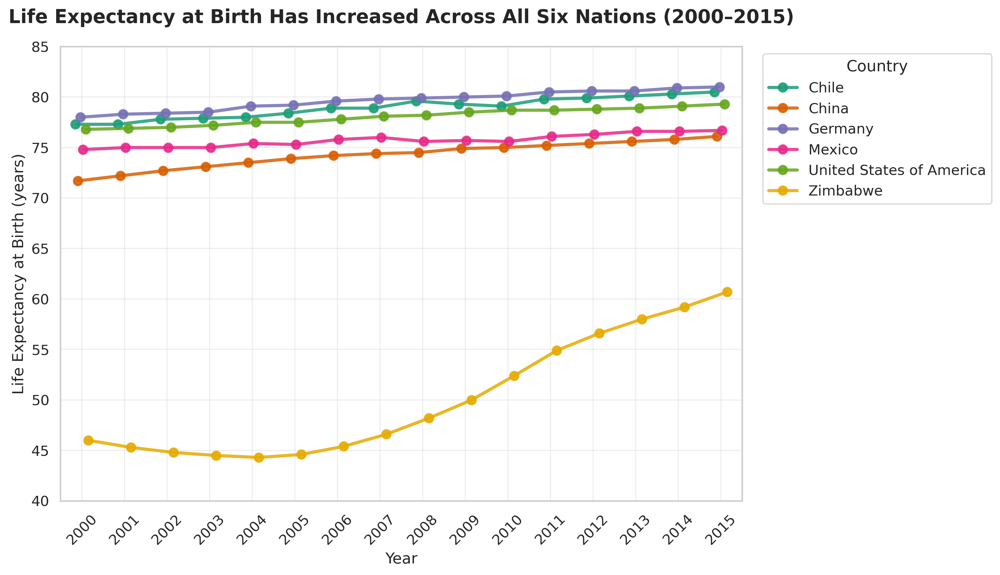
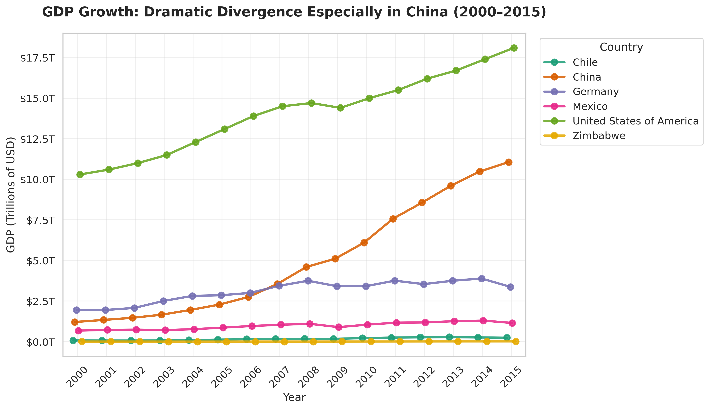
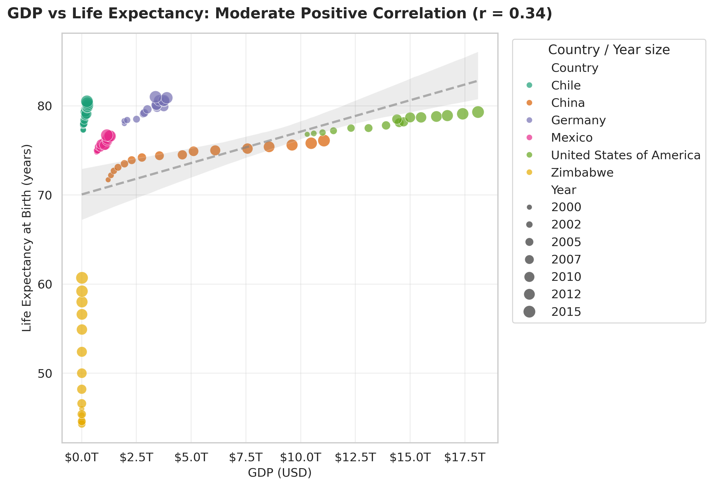
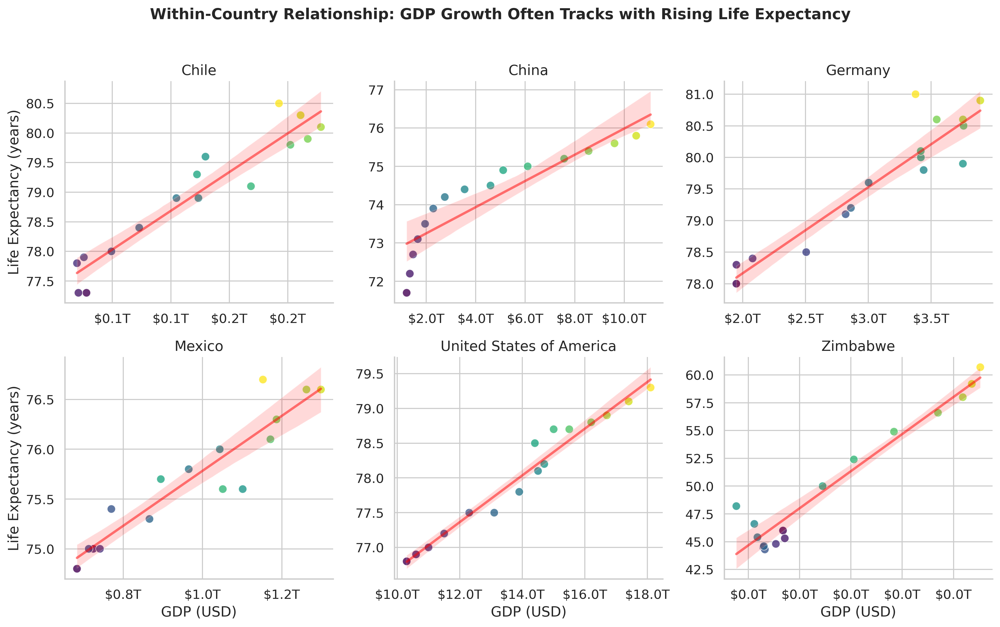
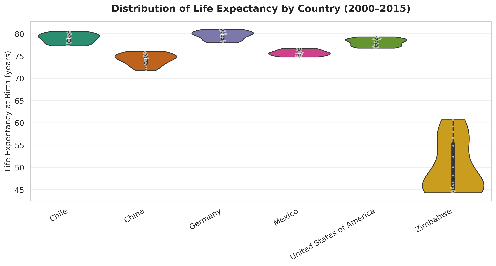

# Life Expectancy and GDP: Uncovering the Relationship Across Six Nations (2000–2015)

**A Data Analysis Portfolio Project**  
*By Randall James | Data Analyst & Project Coordinator*

---

## Project Overview

As a data researcher for the World Health Organization (simulated), I investigated whether there is a meaningful relationship between a country's economic output (GDP) and the life expectancy of its citizens. This analysis uses publicly available data from the **World Bank** (GDP) and **World Health Organization** (Life Expectancy at Birth) for six diverse nations over a 16-year period (2000–2015).

**Core Question:** Is there a correlation between GDP and life expectancy of a country?

This project demonstrates end-to-end data analysis skills: data ingestion & cleaning, exploratory data analysis (EDA), statistical summarization, compelling data visualization with Seaborn & Matplotlib, and data-driven storytelling — all critical competencies for Data Analyst roles.

---

## Key Findings

### 1. Life Expectancy Has Increased in All Six Nations
- **Zimbabwe** saw the largest gain: **+14.7 years** (44.3 → 60.7), recovering from early-2000s economic and health crises.
- **China** gained **+4.4 years** (71.7 → 76.1) amid rapid development.
- Developed nations (Germany, Chile, USA) saw steady gains of **2.5–3.2 years**, reflecting already high baselines and continued improvements in healthcare and living standards.

**Average Life Expectancy by Country (2000–2015):**
| Country                  | Avg Life Expectancy (years) |
|--------------------------|-----------------------------|
| Germany                  | 79.7                        |
| Chile                    | 78.9                        |
| United States            | 78.1                        |
| Mexico                   | 75.7                        |
| China                    | 74.3                        |
| Zimbabwe                 | 50.1                        |

### 2. GDP Growth Varied Dramatically
- **China** experienced explosive growth: **9.1x increase** in GDP (from ~$1.2T to ~$11.1T).
- Chile grew ~3.1x; Zimbabwe recovered ~2.4x after a deep trough.
- USA, Germany, and Mexico grew steadily (~1.7x).

**Average GDP by Country (Trillions USD):**
| Country                  | Avg GDP (Trillions USD) |
|--------------------------|-------------------------|
| United States            | 14.08                   |
| China                    | 4.96                    |
| Germany                  | 3.09                    |
| Mexico                   | 0.98                    |
| Chile                    | 0.17                    |
| Zimbabwe                 | 0.01                    |

### 3. Positive Correlation Between GDP and Life Expectancy
- **Overall correlation (Pearson):** **r = 0.34** (moderate positive)
- The relationship is **stronger within individual countries** over time, especially in developing nations undergoing rapid change (China, Zimbabwe).
- High-GDP developed nations (Germany, USA, Chile) cluster at high life expectancy (~78–81 years), showing diminishing returns at very high GDP levels.
- Zimbabwe illustrates the lower end: low GDP historically correlated with very low life expectancy, with recent improvements in both.

**Insight:** Economic growth is associated with improved health outcomes, likely through better nutrition, healthcare access, sanitation, and education. However, correlation ≠ causation — factors like public health policy, inequality, and healthcare system quality also play major roles.

### 4. Distribution of Life Expectancy
Zimbabwe's distribution is much lower and more variable (recovery phase). Germany shows the highest and most stable life expectancy. Chile and the USA have tight, high distributions.

---

## Visualizations

All visualizations were created using **Seaborn** and **Matplotlib** with professional styling. Full interactive analysis is available in the Jupyter Notebook (`notebooks/life_expectancy_gdp_analysis.ipynb`).

### Life Expectancy Trends Over Time


### GDP Trends Over Time (Trillions USD)


### GDP vs Life Expectancy Scatter (All Countries)


### Faceted View: GDP vs Life Expectancy by Country


### Distribution of Life Expectancy by Country (Violin Plot)


---

## Skills Demonstrated

- **Data Wrangling & Tidying** with Pandas (inspection, grouping, reshaping, handling time-series by country)
- **Exploratory Data Analysis** — summary statistics, trend detection, outlier identification (Zimbabwe)
- **Statistical Visualization** — point plots, line trends, scatter with regression, violin plots, FacetGrid for multi-country comparison
- **Data Storytelling** — translating technical findings into actionable insights for non-technical stakeholders (e.g., WHO policy context)
- **Python Ecosystem** — pandas, numpy, matplotlib, seaborn, Jupyter
- **Portfolio-Ready Documentation** — clean code, narrative explanations, reproducible analysis

---

## Data Sources

- **GDP Data:** World Bank national accounts data (current US dollars)
- **Life Expectancy Data:** World Health Organization (Life expectancy at birth, years)
- Combined dataset provided via Codecademy "Life Expectancy and GDP" capstone project

---

## How to Run This Project

```bash
# Clone the repo
git clone https://github.com/senseirandystl/life-expectancy-gdp-analysis.git
cd life-expectancy-gdp-analysis

# Create virtual environment (recommended)
python -m venv venv
source venv/bin/activate  # or venv\Scripts\activate on Windows

# Install dependencies
pip install -r requirements.txt

# Launch Jupyter Notebook
jupyter notebook notebooks/life_expectancy_gdp_analysis.ipynb
```

---

## Conclusions & Reflections

This analysis confirms a **positive association** between GDP and life expectancy across the six nations studied. Countries that experienced significant economic growth (especially China and recovering Zimbabwe) also saw meaningful gains in life expectancy. However, the relationship is not perfectly linear — developed economies show high life expectancy with more modest recent GDP growth, suggesting other social determinants of health become increasingly important at higher development levels.

**Limitations:** 
- Only six countries; broader global analysis would strengthen generalizability.
- Observational data — cannot infer causation without additional variables (healthcare spending, education, inequality indices).
- GDP does not capture distribution of wealth or quality of life directly.

**What I learned / demonstrated:**
- Importance of contextualizing visualizations (e.g., Zimbabwe's dramatic recovery story).
- Value of faceted and multi-view plots for comparing heterogeneous countries.
- Clear communication of moderate correlation (r=0.34) while highlighting within-country trends.

This project showcases my ability to take a raw dataset, perform rigorous EDA, create publication-quality visualizations, and deliver insights that could inform public health or policy discussions — exactly the kind of work I aim to do as a Data Analyst.

---

## Next Steps / Future Work

- Expand to more countries (full World Bank + WHO datasets)
- Incorporate additional variables: healthcare expenditure % GDP, Gini coefficient, education indices
- Build an interactive dashboard (Plotly Dash or Streamlit)
- Time-series forecasting of life expectancy based on GDP trends

---

*Thank you for reviewing this project. I'm actively seeking Data Analyst, Project Coordinator, or BI Analyst roles in the St. Louis / St. Charles, MO area (or remote/hybrid). Please see my [Data Analyst Resume](https://www.linkedin.com/in/randall-james-stl) and other projects on [GitHub](https://github.com/senseirandystl).*

**Contact:** randalljames34@pm.me | (314) 223-9762 | O'Fallon, MO

---

*This project was completed as part of the Codecademy Data Analyst Career Path capstone and enhanced for professional portfolio use.*
